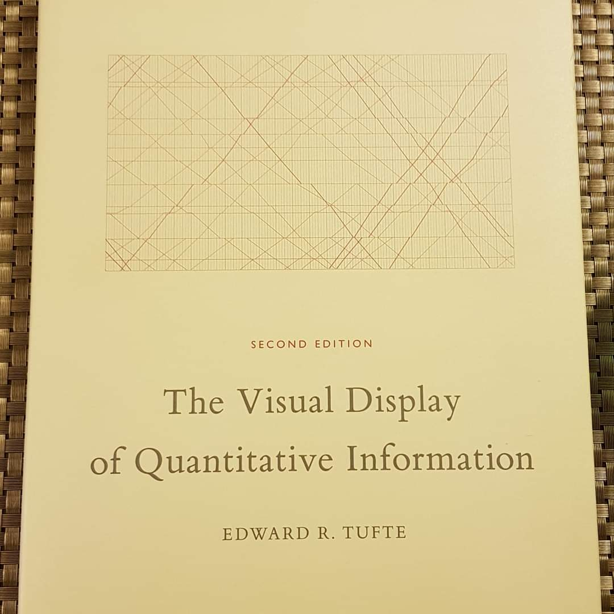

## 贅沢な学びの時間

44歳の誕生日は平日だったが、通常の仕事を離れてエドワード・タフト
（イェール大学名誉教授）による"Presenting Data and Information"
(データと情報のプレゼンテーション法)という一日コースに参加した。
タフト教授の本、特に"The Visual Display of Quantitave Information"は、
表紙に始まり毎ページが本当に美しく、本棚に置くだけでも満足してしまうほどである。
その彼が近所までやってきて一日講義をしてくれると知ったので、
約４万円６千円のチケットを払って、妻も私も聞きに行った。

データの見せ方やデータを用いた訴えかけの手法というのは、
データサイエンティストとして大事なトピックだ。
しかし通常8割以上は実務的なことばかり考えているので、
ツール・テクニック・採算性から一旦自分を解放し、
自分よりもずっとアカデミック寄りの空気を呼吸している人々の話にひたすら耳を傾けるのは、
ある意味贅沢な時間の過ごし方(そして経費の使い方)だと思う。

それができる環境だったのは、今年の仕事生活で良かったことの一つだ。
今年は気楽な一人会社に戻り、皮肉にもチームを抱えていた去年よりも売上は上回った。
10月末でその売上は見えていたので、11月、12月は月の半分程度をクライアントへの仕事に使い、
残りは家族と日本や台湾を旅行したり、上のようなセミナーに参加したり。
もしくは、ふらふらっとドライブしながら、来年の事業展開を考えたり。

## フリーランス?

<iframe width="560" height="315" src="https://www.youtube.com/embed/5voHs1CaTZ4" frameborder="0" allow="accelerometer; autoplay; encrypted-media; gyroscope; picture-in-picture" allowfullscreen></iframe>

そういう時に繰り返し思い出すのは、独立して間もない頃に元同僚で良き友人の口からでた一言だ。
サンフランシスコにも毎年フリートウィークがあり、中でも海軍のエース、
ブルーエンジェルスによる圧巻の航空デモンストレーションは、
日本でも知っている人も多いと思う。
独立したての2017年10月、その航空ショーをマリーナ地区にある友人宅アパートの屋上で、
ビールを片手にただ見している時、彼は私を別の友人に、

「ダイゴはファイブスターズ（前職のスタートアップ）を辞めて、フリーランスをしている。」
と紹介した。

彼に悪気はなかったのだが、私は内心むっとした。

私は「フリーランスになろうとしていたのではない、会社を作っているのだ。」
と言いたかったのだろう。
そこらにいるフリーランスとは違い、現に法人化を済ませていたし、
上場企業からスタートアップまで、安くないフィーをとって仕事も始まっていた。
今後、どのような企業文化をもって成長してゆくのかを、走りながら考えていた。
でも一人だったので、そと見からフリーランスと言われても仕方がなかった。

そういう風に気が張っていたので、翌年（2018年）には得意先から紹介された人材を雇って、
チーム運営できるかの実験を積極的に行なったが、
それが思うように行かなかった事は[昨年の日記](http://www.daigotanaka.org/43-years)に書いた。
その翌年にあたる今年は、体勢を立て直し、当初のビジョンを見つめ直すため、来る
仕事は拒まず一人で回し、
オフショアのコンストラクター会社を使って大き目な仕事を引き受けたりと、
黙々とクライアントの期待に応えていった。

## 時間の主導権

そんな一人会社の生活は大変忙しくなる時期もあったが、
チームメンバーを育てるという労作業から一旦解放されたのもあって、
自分の時間の主導権は常に握っていた。
睡眠、食事、運動と自分の健康を最優先。生産性の高い自分を作った上で仕事は集中的に片付けた。
だから仕事の量が多いときでも、妻や子供との時間は充実していたし、
平日の昼間に娯楽に興じたりもできた。

「時間がある」ではなく、「時間の主導権を握っている」
ことが健康で生産性の高い生活を送る上で肝要なのだろう。

去年従業員を抱えてみて体験してみたのは、
仕事や売上があるかないかにかかわらず、
彼らの「時間」に給料を払い続けなければいけない、という当たり前のことだ。
そのお金が投資家から出ていようが売上から出ていようが、実行し続けられる会社は尊敬する。
自分の会社がそこまで行っていない事は痛みをもって実感できた。

翻って従業員の立場も思い出した。仕事の忙しいときも、
そうでないときも給料は毎月規則正しく入ってくる。
ただし、仕事が軽くなる度に家でごろごろしたりできるわけではない。
周りを見て、何となく帰りづらいので定時までオフィスにだらだらといたり、
ということは結構あったと思う。
そういうときは生産性ゼロだし、気疲れだけが溜まる。
所属会社にいかに価値をもたらすかも大事だが、
従業員が会社に囲われて時間とお金を交換している側面は否めないと思う。

私は今、時間の主導権を取り戻し元気溌剌に生産している。
反対に、従業員から時間の主導権を買う雇用主、
時間の主導権をお金と引き替えにする従業員という関係は、
本当に私達の生産性と健康にプラスの影響を与えているのだろうか。
(勿論このような問いかけは、リモートワークのような形で、
情報技術を一身に享受できる頭脳労働の立場にいるからこそ湧いてくるものだ、
という事は認識している。)

## 会社をエンジニアリング

さて私はこれから、とりもどした時間の主導権を一体どう使ってゆくのだろうか。

あまり大それたことを企てるタイプでもないので、考えの起点はいつも、
これまでを振り返って、次の一手を決めることになる。
現在、5社ほどのクライアントに次のような内容のお手伝いをさせてもらっている。

1. 新規事業へのプロダクト、エンジニアリング、データという視点からのアドバイス
2. データサイエンス、アナリティクス、エンジニアリングのプロジェクト（納入ベース）
3. オフショアリソースを使ったウェブ開発案件
   （どうしてもと頼まれたので例外的に請け負っている）

幸いそれぞれのクライアントから喜ばれていて来年も案件は継続していく予定だ。
これらをこなしてゆくだけで何となく忙しく時は過ぎ、
今年と同じような規模のビジネスとなるかもしれない。
でもそれではフリーランスと変わらない。会社をエンジニアリングしたい。
つまり、会社が顧客にユニークな価値を提供する仕組みをつくりたい。

会社の仕組みづくりには、

1. 人的組織
2. サービス自動化

の二通りがあると思う。昨年は資金が少ない中、前者を達成する難しさを体験し、
今年一年はそのダメージから体勢の立て直しの期間だった。
2020年はサービス自動化という角度を模索したい。

実は今、クライアントに一旦納入したシステムのメンテの月額化を持ちかけて、
話はよい方向に向かってる。実現すればそのシステムをニッチクラウドサービス化して、
新しい顧客にサブスクリプション形態での提供する端緒になる。
そこで得た安定的でスケールする収入は継続的サービス向上に使い、
新旧クライアントの満足度もあがれば素晴らしいなという夢だ。

ANELEN設立から念頭にあったのは、
データプロフェッショナルサービスでクライアントに尽くす中で、共通の問題を見つけ、
最初はオーダーメイドだった解決法を徐々に共通化・自動化し、
より多くの会社の役に立ってゆくサービス構築ができるかということだった。
今回のサービス化はその実験第1号となる。

## 空っぽのコップ

誕生日の夜は子供が寝静まった後、妻とワインを片手に
"[Inside Bill's Brain](https://www.netflix.com/title/80184771)"
という、ネットフリックスのドキュメンタリーを見て締めくくった。
マイクロソフト創業者のビル・ゲイツの頭脳にせまるドキュメンタリーだ。
世界最大の慈善基金団体であるビル&メリンダ・ゲイツ財団の活動として、
衛生・気候変動・エネルギーといった人類喫緊の課題に立ち向かう様子が、
彼の生い立ちの紹介と並列して語られている。インタービューの中で、
彼の挑戦とは人々を感化（インスパイア）することでなく、
人類の生産活動を最適化することにあるという言葉が出て、実業家の真骨頂を見た思いがした。

自分のことを振り返るとき、自分はつくづく「空っぽのコップ」だと思うことがある。
あくまで有用なコップのつもりだが、
その機能を何に役立てようかは中々自分では決められない。
コップの自分を魅了する人との出会いをいつも待っている。

ツールと言っても良いかもしれない。
博士課程での研究時代も与えられたテーマを真面目にやりぬく一方、
そのテーマが自分の魂、血肉化することはついに起こらず、
常に他人の持ってきてくれた仕事という感じだった。それが博士号取得後、
大学を去る一番の理由になった。その後もシュルンベルジェでの原油探査事業や、
ファイブスターズでのリテールテクノロジースタートアップで、
様々な問題の解法を考えていくなかで多様なスキルを身に着けたものの、
それをどういうテーマに応用して役立ってゆきたいかの答えは見つからず、
常に他人のツールという感じだった。

そしてある時、ツールならツールに徹しようと自分に言い聞かせるようになった。
現在のデータプロフェッショナルサービス業がうまく回っているのも、
こういう自分だからかもしれない。

## 精神的レガシー

ただ、二人の子供が育ってそれぞれに個性を見出すようになると、
彼らにどんなレガシー、精神的遺産を残せるのか、
その具現としての仕事について考えることが多くなる。
ファイブスターズ共同創業者でCTOのマット・ドーカは若い頃、
医者だった両親について途上国での慈善診療の手伝いをしたという。
それ体験が彼の人を包み込むような人格を作ったようだ。
我が子の心の芯に、親としてどんな原体験を残せるのだろうか。
子供は親の背中をみて育つと昔から言われるが、子供の視線を背中から感じつつ、
私はどんな仕事ができるのだろうか。

どうかこのコップに熱いものを注いでもらいたい。
そんな出会いが今の仕事を通じてできれば素晴らしい、
というのもANELENを始めた時に期待していたことだ。
実はその願いが叶うかもしれない話も舞い込んできた。

アフリカで小規模農耕に従事する方々を情報支援するプロジェクト(NGO)
の共同設立の話をクライアントCEOから持ちかけられたのだ。
これに関しては、ある巨大慈善団体からの資金援助の話もすすんでいるが、
具体的な話はこれからなので、来年の誕生日日記にて報告できればと考えている。

これまでの誕生日日記：

- [43歳](https://www.daigotanaka.com/ja/43-years/)
- [42歳](https://www.daigotanaka.com/ja/42-years/)
- [41歳](https://www.daigotanaka.com/ja/41-years/)
- [40歳](https://www.daigotanaka.com/ja/40-years/)
- [39歳](https://www.daigotanaka.com/ja/39-years/)
- [38歳](https://www.daigotanaka.com/ja/38-years/)
- [37歳](https://www.daigotanaka.com/ja/37-years/)
- [36歳](https://www.daigotanaka.com/ja/36-years/)
- [35歳](https://www.daigotanaka.com/ja/35-years/)
- [34歳](https://www.daigotanaka.com/ja/34-years/)
