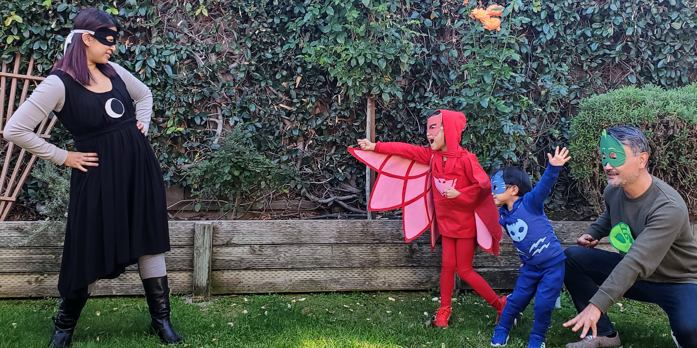

今年の誕生日日記の本題として、架空の世界の道具でしかなかった英語が身体化するまでの話を書こうと思う。

## 一年間の出来事

英語の話が長くなってしまうので、まずはこの一年で心に残ったことを簡単にメモしよう。

### エクジット

<blockquote class="twitter-tweet">
シード期から約６年勤めたファイブスターズが317ミリオンドル(約360億円)で欧州のサムアップに買収され、無事エクジットとなりました。 - European point of sale provider SumUp acquires customer loyalty startup Fivestars for $317M <a href="https://t.co/41icdTJHVw">https://t.co/41icdTJHVw</a> <a href="https://t.co/ZbOTMB2jNc">pic.twitter.com/ZbOTMB2jNc</a>
&mdash; 乃悟 (@daigowho) <a href="https://twitter.com/daigowho/status/1448717392687681538?ref_src=twsrc%5Etfw">October 14, 2021</a></blockquote> 

草創期から約6年勤めたファイブスターズが317ミリオンドルでヨーロッパのSumUpという会社に買収された。

### 子育てを通じた出会い

この地域で生活していて面白いのは、起業家としてユニークな活動をしている人が多いことだ。
そういった人たちと子育てを通じて出会うことができる。

6歳の上の子が仲良くする同級生のお父さんは部屋の収納をロボット技術でスマート化するスタートアップのCEO。
こちらはアップル、テスラなどで活躍し、テスラでは一時期イーロン・マスク直属だったので、いろいろ興味深い話も聞けた。
マスク第一原理思考は有名だが、彼は常人が思いつかないような発想と基礎からの積み上げ思考ができるので、専門家チームからのブリーフィングもすぐに理解し、核心部分に切り込んで行くらしい。恐ろしい限り。

3歳の息子が通っていたデイケアでの友達のお父さんは、医療デバイスを開発するスタートアップの創業者。
彼とはとても仲が良くなり、キャンプをともにしたり、デイケア卒業後も子供の一緒の水泳レッスンに通わせたりと時間を一緒にしながら、仕事の話も楽しく交換している。

### ミニ・キャンプ

今年は子供をキャンプに3回連れてゆくことができた。
パンデミックで飛行機や遠出は無理なので、近場でキャンプを体験してみようと友人とはじめた。
子どもたちにとって非常に良い経験となったようだ。
幸い車で20分くらいのところに街の喧騒から逃れるキャンプ場がある。
小さい子供を連れて何かあってもすぐ帰れる状態で、キャンプ体験を重ねられる。
来年も続けようと思う。

初回は妻と娘を家に置いて、3歳になった長男と二人きりで一晩テントにこもった。
キャンプ中、母を恋しがることもなく、息子と二人きりでこういう思い出を作れる年齢になったのが嬉しかった。

### ビジネス

昨年の日記には、パンデミックで閉じこもる生活がはじまり、仕事の面でも不安な出だしだったが、結果的に経済的に一番成長できたと書いた。
今年はその流れにのる形で、去年より大きく売上を伸ばし、ビジネスを始めてから売上げが過去最大になった。
昨年はデータパイプラインサービスを効率的に運営するために作ったツール、ハンドオフをオープンソースソフトウェアとして無償公開した。
今年はそのコア技術をウェブサービスに接続し、データ統合サービスのオペレーションの一層の効率化を図った。

約5年前にビジネスを始めたときから、
1. オーバーヘッドのないコンサルティングからビジネスを始め
2. ターゲット顧客の共通の課題を見出し、コンサルティングの安定効率化
3. コンサルティングからサービスへの移行
4. ソフトウェアによるサービスオペレーションの効率化
5. 製品化
を徐々に進めるというプロセスを念頭においていた。

今回のウェブサービス化は上の4に当たる。
これにより更に多くの顧客にサービスを提供する下地が整った。
ここでの学びは、コンサルティングと製品・サービスでは売り方が大きく異るということだ。
今まではコンサルティングスタイルのビジネスをアウトバウンド営業で取ってきた。
今年の後半からはソーシャルネットワークを中心としたマーケティング活動を通じてインバウンドのリードを作りながら、製品・サービスを売ってゆくことを実験している。

<video width="100%" controls poster="../images/handoff-1min-intro.png">
  <source src="https://handoff.cloud/assets/video/handoff-1min-intro.mp4" type="video/mp4">
Your browser does not support the video tag.
</video>

データ統合事業は、小さなビジネスとしては数年前の立ち上げ当初から黒字が続き利益率も拡大している。
幸い既存顧客からは愛され、来年も通年契約延長と拡大の運びになっている。
ここから新規の顧客を獲得する型をつくるのが、目下のテーマだ。

## 趣味

そのほかにもブリスケットを12時間かけてスモークすることを学んだり、オキュラスクエストやレイバンストーリーズといったメタ社(フェイスブック)の製品を買って体験してみたり。

<blockquote class="twitter-tweet">
ブリスケット2回目挑戦。今度はちゃんとスモークリングが出た。コストコで14ポンド(6.4kg)の肉を40ドルで仕入れ。フラット側2ポンドはシチューの為に落として、更に4ポンド脂肪を切り取った後の8ポンド。これで私のセラミックグリルにも収まった。夜通しで8時間スモーク後、ホイルに包んで更に4時間。 <a href="https://t.co/szk6IqMERC">pic.twitter.com/szk6IqMERC</a>
&mdash; 乃悟 (@daigowho) <a href="https://twitter.com/daigowho/status/1361595982673104900?ref_src=twsrc%5Etfw">February 16, 2021</a></blockquote> 

<blockquote class="twitter-tweet">
<a href="https://twitter.com/hashtag/%E3%83%A1%E3%82%BF%E3%83%90%E3%83%BC%E3%82%B9?src=hash&amp;ref_src=twsrc%5Etfw">#メタバース</a> で仕事してみたよ。 <a href="https://t.co/WF35dERJs8">pic.twitter.com/WF35dERJs8</a>
&mdash; 乃悟 (@daigowho) <a href="https://twitter.com/daigowho/status/1438215704260472836?ref_src=twsrc%5Etfw">September 15, 2021</a></blockquote> 

<blockquote class="twitter-tweet">
<a href="https://twitter.com/hashtag/%E3%82%B5%E3%83%B3%E3%82%AF%E3%82%B9%E3%82%AE%E3%83%93%E3%83%B3%E3%82%B0?src=hash&amp;ref_src=twsrc%5Etfw">#サンクスギビング</a> は七面鳥とおきまりですが、我が家は毎年、家鴨をスモークしてます。<a href="https://twitter.com/hashtag/%E3%83%AC%E3%82%A4%E3%83%90%E3%83%B3%E3%82%B9%E3%83%88%E3%83%BC%E3%83%AA%E3%83%BC%E3%82%BA?src=hash&amp;ref_src=twsrc%5Etfw">#レイバンストーリーズ</a> で撮ってみました。 <a href="https://t.co/URZ1Chf5t3">pic.twitter.com/URZ1Chf5t3</a>
&mdash; 乃悟 (@daigowho) <a href="https://twitter.com/daigowho/status/1464121316634628098?ref_src=twsrc%5Etfw">November 26, 2021</a></blockquote> 

これは仕事と趣味の中間になるが、年末にはリンクトインでのターゲットオーディエンスへのリーチに興味がわき、コピーライティングのワークショップに参加したり、12月の平日には毎日ビデオミッセージをポストするチャレンジに参加した。

- [リンクトインのビデオチャレンジ(最終日)](https://www.linkedin.com/feed/update/urn:li:activity:6882712801111101440/)

<blockquote class="twitter-tweet">
Yes! I posted 21 videos for the last 21 weekdays (and more) on LinkedIn in December. And it&#39;s a wrap:<a href="https://t.co/IYoQ7F6OjA">https://t.co/IYoQ7F6OjA</a> <a href="https://t.co/jM6Dvr00n2">pic.twitter.com/jM6Dvr00n2</a>
&mdash; Daigo (@DaigoTanaka) <a href="https://twitter.com/DaigoTanaka/status/1476968805658415104?ref_src=twsrc%5Etfw">December 31, 2021</a></blockquote> 

さて、本題へ。

## 外国語の身体化の話

ちょうど30年前、高校2年の夏休み。
親に懇願してロンドン近郊の英語サマースクールに約一ヶ月参加した。
それまで旅行を含めて海外経験はゼロ。
16歳の純国産坊やが単身ブリティッシュ・エアウェイズに乗り込みヒースロー空港に降り立った。
英語のクラスでは自分以外はすべてバカンス気分のイタリア人。
他のクラスには日本人の大学生も見かけたものの、せっかく海外に来たのだからと、日本人との接触は頑なに避けていたのを思い出す。

日本では教科書を読んだり、テープを聞いたり、教室の中でロールプレイするだけだった英語。
それまでは架空の世界の道具でしかなかったが、眼の前のイタリア人と仲良くなりたい一心で使いに使った。
日本語で考えて翻訳しながら話すのでは遅すぎると気付き、英語で考えることも意識するようになった。
特に仲良くなったマッシモと、
> "Now I can think in English."(英語で考えられるようになったよ)
> "Me, too."(僕もだ)
という言葉を交わしたのを覚えている。彼とは帰国後も文通を続け、大学生、大学院生の時にミラノ等で2度再会した。
架空の世界の道具だった英語を使って急速に友情を深めることができた。

実際マッシモと遊び歩いたのはたったの2週間ぐらいだったかも知れない。
今振り返ると、若い時の吸収力と友情を深めるスピードは驚嘆に値する。
(10代、20代の方々には、国内でも国外でも、自分の興味に素直になり、勇気を持って飛び込んでいってほしい。)
その後、私は大学1年の夏にフィレンツェに42日間滞在してイタリア語を学んだり、大学院では国際学会に参加・発表した。
16歳のあの夏を契機に、日本を出ることへの抵抗はどんどんなくなっていった。
そして大学院生だった2000年に2年間の客員研究員の機会を得て渡米。
当初2年の予定が、昨年で在米20年となった。

20年の間、私の脳は英語で情報処理するようになった。
カーネギーメロン大学での博士課程では新しい知識は英語で学んだ。
就職してから仕事は100パーセント英語。
日本人の友人は数えるほど。
そして米国人の妻と結婚したので家庭でも英語。
そして二人の幼い子供には「お父さん」ではなく"Dada"と呼ばれ、英語で応える。

英語で考えると書かずに、英語で情報処理と書いたのは、実際英語で深い思考ができるのかに疑問があるからだ。
人格をつくるのに役立つような読書は10代、20代に日本語で読んだし、英語で文学、哲学を読むのは本当に疲れる。
一方、この20年の間、日常での体験は99パーセント英語だった。

生まれてから24歳までの日本語生活と10代、20代での日本語での読書と思考、渡米後の英語での日常生活と体験的な学び。
前者と後者は水と油のように混ざり合わず、断絶している不安にわたしは駆られる。

「日本語で考えているときの自分と、英語での自分は人格的に分裂していまいか。」

そのような危惧を覚えるのにはいくつかの理由がある。

一つは、20年たった今も英語での思考が自分の意識の表層で上滑りしていて、深層、無意識、こころにつながっていない気がすることだ。
誤解を恐れず極論すれば、英語での思考と会話は言葉の遊びで、フィクションを書くように自分のこころと距離をおいた言葉を吐き出せるような気がするのだ。
日常、仕事や家庭での会話では問題にならないが、道徳、倫理、人生観を問われるような場面では、英語で発する言葉が本当に自分のこころから発せられたものなのか、役者のセリフのように出てきたものなのか、わからなくなることがある。

二つ目は、日本語で考えるからこそ出てくる発想、英語で考えるから出てくる発想というものがあることだ。
はじめに英語で書いたり話したことを日本語で伝える時に、同じ表現が見つからずに困ることがある。
直訳ができないというレベルでなくて、発想そのものが違うといえばわかってもらえるだろうろうか。

認知科学者の妻にこのことを話すと、サピア＝ウォーフの仮説というものを教えてくれた。
言語相対性仮説とも呼ばれるこの考え方は、人の思考は使う言語に影響を受けるというものだ。
言語相対性仮説の世界はさらに言語決定論と言語相対論に分けられる。
言語決定論は使用する言語が認知の限界を定義するという強い主張で、現代の言語学者の間では退けられた主張だ。
言語相対論はそれよりは穏やかな主張で、使用する言語が意思決定に影響を与えるとする。
ちなみに現代認知心理学では実験を通じて、言語相対論が当てはまる場面とそうでない場面を慎重により分けているようだ。
有名な実験の種類として、色にまつわる語彙の言語間の相違に関するものや、仮定法過去(半事実)表現の有無がもたらす論理的思考の相違などがある。(前者は基本的な知覚を、後者は抽象概念を研究の対象にしている）

認知科学では、異なる仮説を掲げる学者が論を戦わせたり、特定の場面に特化した実験を繰り返して各学説が矛盾する場面を洗い出したりと地道な研究が続いている。
言語相対論のように、「それらしい」という理由で大衆に信じられやすい学説も、実は決定的な理解や証明が終わってないのだ。
そればかりか「左脳は論理、右脳は感覚」のように、現代の神経科学的知見からはまったく支持されないのに、大衆からは未だにもてはやされている俗説がまかり通っている状況だ。

学術界でも脳への理解はその程度なので、私の日本語と英語での人格、記憶、思考が本当に断絶されたものなのか、それとも単なる思い込みなのかといえば、おそらく私の勝手な思い込みの部分が大きいのだろうと考える。
(こう書いたのには、日本語脳・英語脳の分裂など一見複雑高尚そうな理論の当時者として自己陶酔しそうな自分をオッカムの剃刀によって、そんなの単純な思い込みだと両断、自己嘲笑しているに他ならない。)

この日記を書き始めた当初は、20代までに培ってその後の英語生活により埋没潜在化した旧人格と、渡米後の英語をしゃべりながら米国社会で生き残るために身についた思考特性の折り合いをどう取るか、そして自分というもの統合性をいかに取り戻そうかという挑戦について書こうと考えいてた。
しかし書きながら、言語相対論の論文なども覗き見していくなかで、人格の断絶というほど極端なことは起こっていないのだろうと思うようになった。むしろ英語での読書の浅さ、それに伴う表現力の乏しさが本当の問題なのかもしれない。

これからも活動の中心が米国であること、そして子供が英語を母国語として育っていく以上、英語で厚みのある議論ができる自分になりたい。それにはかつて日本語で読んだものを含めて、英語で文学、哲学を読みなおす地道な努力は避けて通れない。

20年以上のの在米生活の後、仕事と日常生活以上には英語が身体化していないことを再認識した。
今は残念な状態だが、これからでも遅くはない。地道に積み上げていこうと思う。

これまでの誕生日日記：

- [45歳](https://www.daigotanaka.com/ja/45-years/)
- [44歳](https://www.daigotanaka.com/ja/44-years/)
- [43歳](https://www.daigotanaka.com/ja/43-years/)
- [42歳](https://www.daigotanaka.com/ja/42-years/)
- [41歳](https://www.daigotanaka.com/ja/41-years/)
- [40歳](https://www.daigotanaka.com/ja/40-years/)
- [39歳](https://www.daigotanaka.com/ja/39-years/)
- [38歳](https://www.daigotanaka.com/ja/38-years/)
- [37歳](https://www.daigotanaka.com/ja/37-years/)
- [36歳](https://www.daigotanaka.com/ja/36-years/)
- [35歳](https://www.daigotanaka.com/ja/35-years/)
- [34歳](https://www.daigotanaka.com/ja/34-years/)
