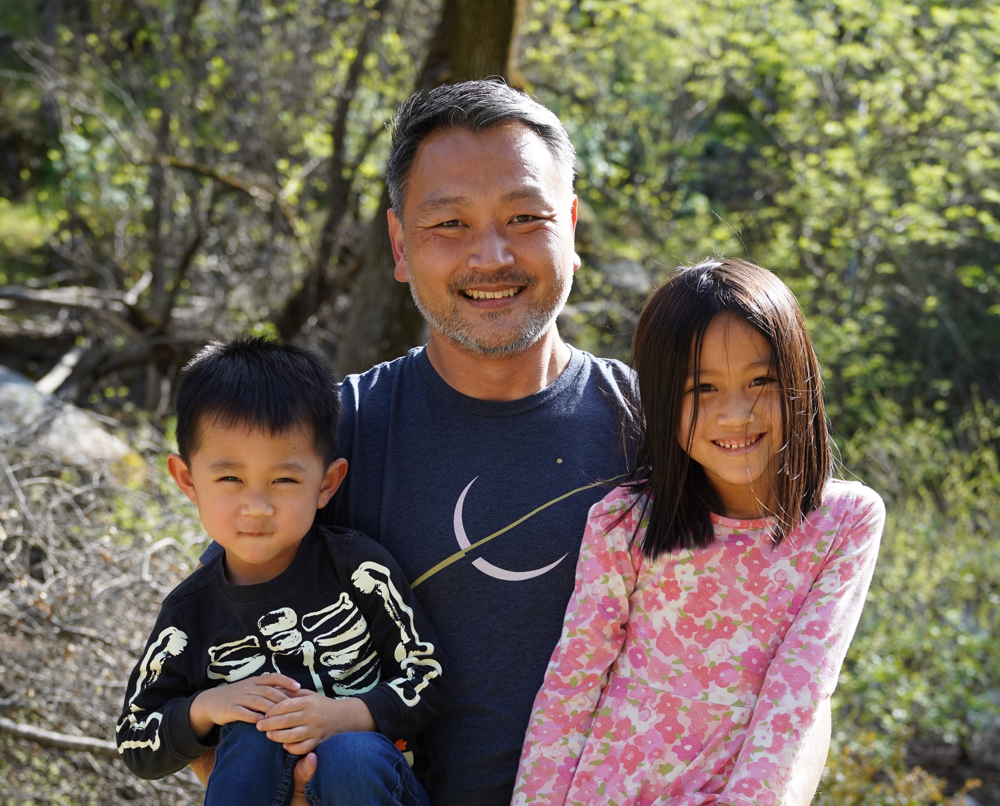
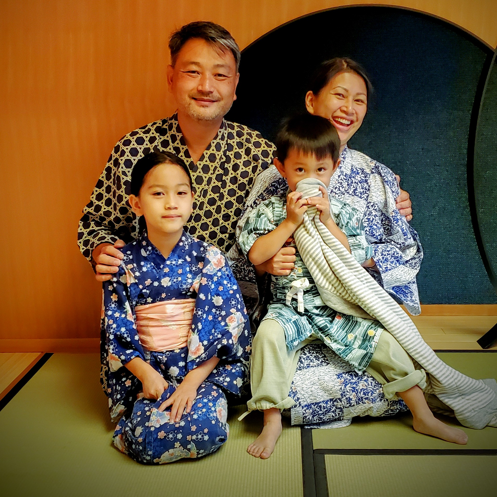
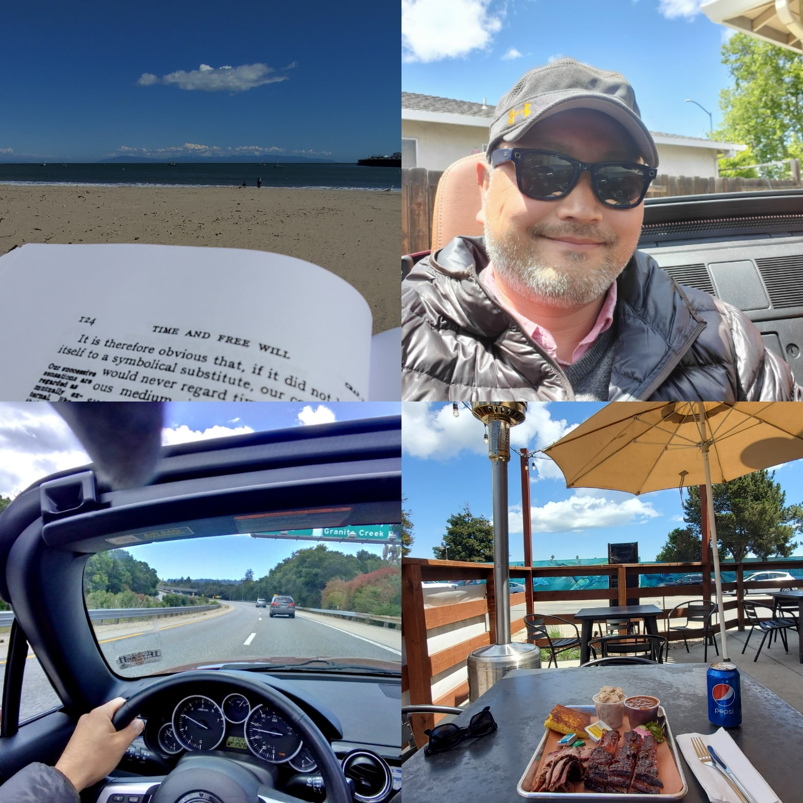
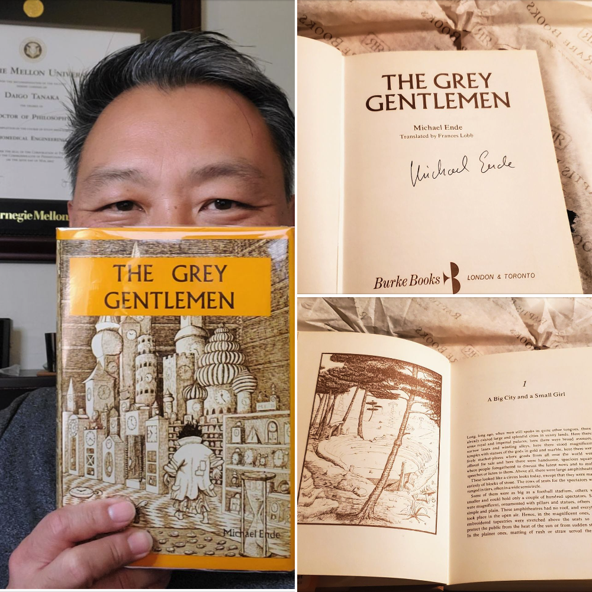
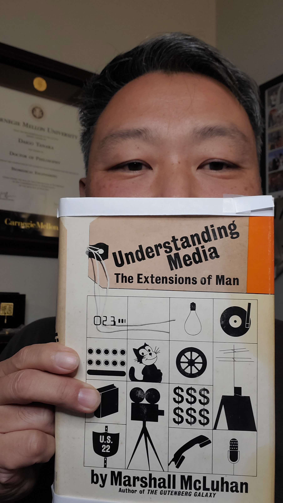
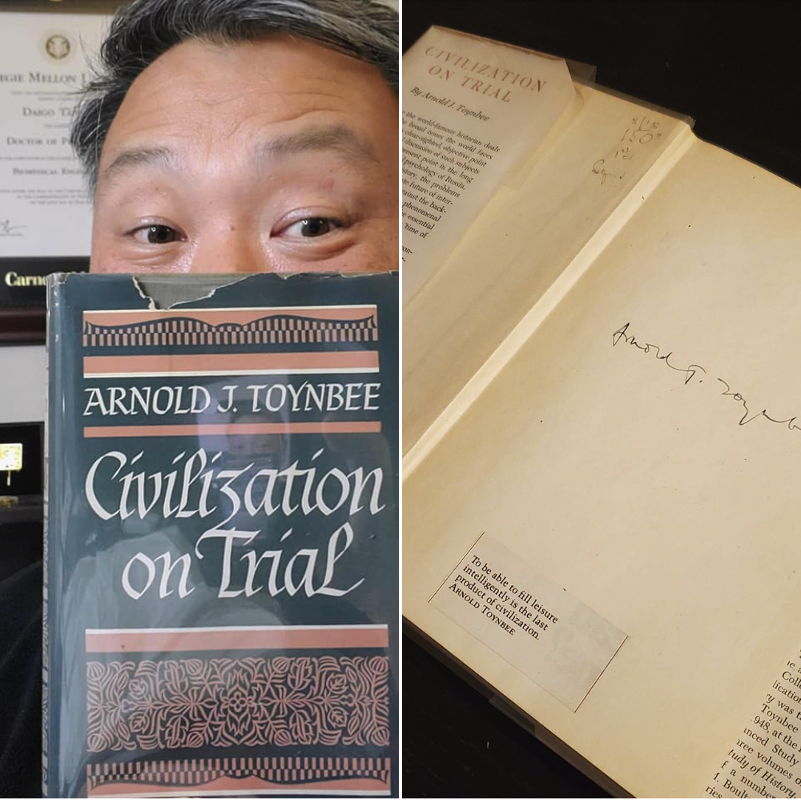
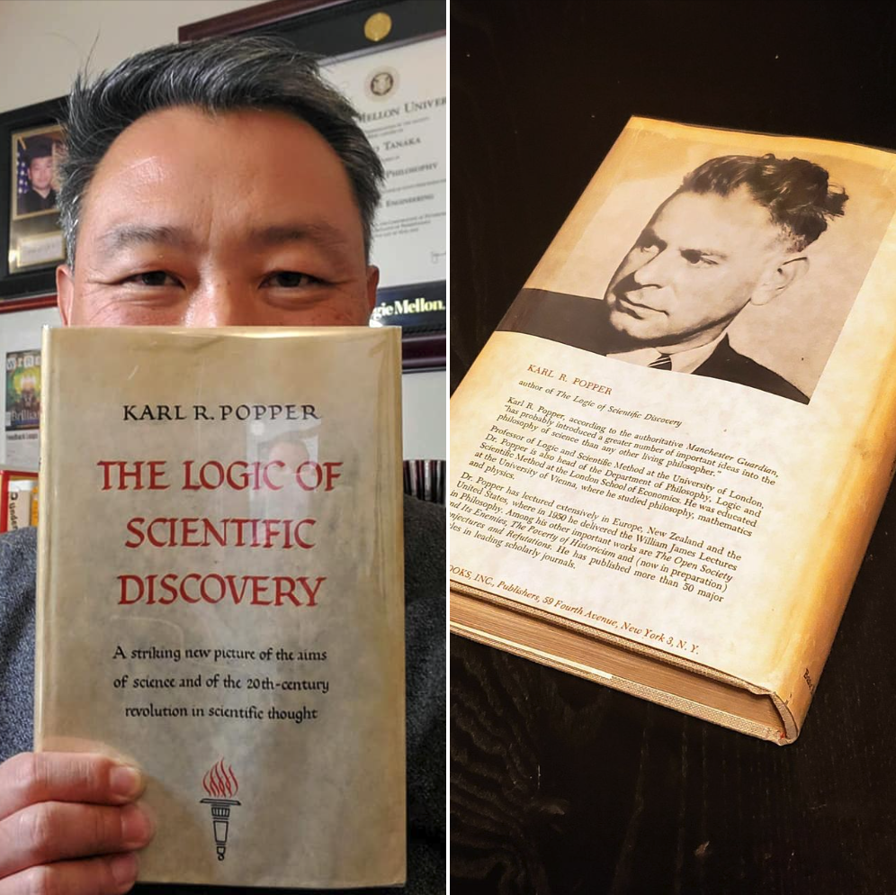

*"Manche Dinge brauchen ihre Zeit – und Zeit war ja das Einzige, woran Momo reich war."*

*"Lots of things take time, and time was Momo's only form of wealth."*

*「なんであれ、時間というものがひつようなことがあります ー それに時間ならば、これだけはモモがふんだんにもっているものなのです。」
ミヒャエル・エンデ 「モモ」より*

## 私が時間という富を築いたプロセス

独立して5年、今年ほど時間のゆとりがあったのは初めてかもしれない。

一言で言えば、自分への投資が時間という形のリターンをもたらした。

どのような思いではじまり、どのように実を結んだのかを少し追って見たいと思う。

仕事を初めて数カ月後、[5年前の誕生日日記](https://www.daigotanaka.com/ja/42-years/)にこんなことを書いた。

> 取れるリスクを年々大きくする。このことは投資に限ったことではなく、 自分の職業的な身の振り方にも当てはまる。 私がこの歳に至って起業という決断をしたのも同じ考えの延長だ。
>
> 40歳前後で人生に焦りを覚え、遅ればせながら子供が出来た時、これからどういう人生を送りたいか考えた。
> 1. 時間：家族との時間を第一にしたい。娘との貴重な時間を大切にしたい。
> 2. 生きがい：ゆくゆくは人に役立つ仕事を残したい。
> 3. 経済力：さらに豊かになり、経済的自由を獲得したい。
>
> このような願望をもったとき、普通の勤め人では駄目だと思い、転職は選択肢からなくなった。 また率直に言って、他人が作った会社に勤めるということに飽きていた。 幸い、独立に挑戦する準備は整っていた。それは、
> 1. 半年くらい収入がなくてもなんとかなる貯金はある
> 2. 独立後のフィナンシャルプランに家族は合意している
> 3. 市場のニーズと対価は確認できた
> 4. 失敗した時のプランがある（3ヶ月以内には再就職できるだろうという目安）
>
> ということだ。金銭、スキル、家庭環境、社会環境、それぞれの面で何年もかけて自分なりに、 少しずつ成長してきた結果だ。
> だから金銭の上では、それまで株式投資に回していたお金の一部を自分の独立事業に投資する感覚で決断ができたのだ。

上のアプローチは、家族持ちで独立・起業する者として、現実的な正解だったと思う。
「何故起業するのか」に、大義名分ではなく自己中心的な答をもっている。社会に提供できる何かを持っている。全損しても大丈夫な規模の投資として捉えている。失敗したときのプランがある。これらは最低限のチェックリストだと思う。

[4年前](https://www.daigotanaka.com/ja/43-years/)にこんなことを書いた。

> 今のシリコンバレーを見ていると、チャップリンのモダンタイムズが思い出される。 工場から頭脳労働へのシフト、資本家の労働者搾取からストック・オプションへと 表面的には異なる風景が広がるものの、 目標が労働者を駆り立て人間性から目をそらす構造は何も変わっていない。 その思いは、長女の誕生を機に拭い難い問題意識となる。もはや自分勝手は許されない。 それからは、いかに父親としての務めを果たすかが行動の基準となった。 同時に退屈が最大の脅威である。子育てのために安定した仕事に就いたら、退屈が私を殺すだろう。
>
> ソフトウェアエンジニアからデーターサイエンティストに転身したのも、 独立してコンサルティング事業を始めたのも、 そうした自分の性分と家族への責任の折り合いをつけるための長期計画だった。
>
> 一人の人間としてまずは生ききる。家族と苦楽をともにし、家庭での責任を果たしながら、 社会の一員として確実に貢献をしてゆく。 43歳の自分は、周囲の自分より若い世代に、そういう生き方の一例を示してゆきたいだけなのだ。

今、シリコンバレーではレイオフの嵐。会社から与えられた株が急落しきったところで人々は会社からほっぽりだされている。
自分は同地域に居ながら、そういうドラマを対岸の火事のように眺めていられる。
独立にはリスクが伴うが、他に食う道のない会社員と結果的にどちらが危ない橋だったのだろうか。

[3年前](https://www.daigotanaka.com/ja/44-years/)には時間の主導権と生産性について書いた。

> 一人会社の生活は大変忙しくなる時期もあったが、 チームメンバーを育てるという労作業から一旦解放されたのもあって、 自分の時間の主導権は常に握っていた。 睡眠、食事、運動と自分の健康を最優先。生産性の高い自分を作った上で仕事は集中的に片付けた。 だから仕事の量が多いときでも、妻や子供との時間は充実していたし、 平日の昼間に娯楽に興じたりもできた。
>
> 「時間がある」ではなく、「時間の主導権を握っている」 ことが健康で生産性の高い生活を送る上で肝要なのだろう。
>
> 私は今、時間の主導権を取り戻し元気溌剌に生産している。 反対に、従業員から時間の主導権を買う雇用主、 時間の主導権をお金と引き替えにする従業員という関係は、 本当に私達の生産性と健康にプラスの影響を与えているのだろうか。 (勿論このような問いかけは、リモートワークのような形で、 情報技術を一身に享受できる頭脳労働の立場にいるからこそ湧いてくるものだ、 という事は認識している。)

こう書いた数ヶ月後にはコロナでリモートワーク時代が始まり、今では世間でも同じ様な声を聞くようになった。

そして[一昨年](https://www.daigotanaka.com/ja/45-years/)、それまでコンサルティングや納入ベースの仕事からの収入に加え、自動サービスによる収入が入るようになった。
コード・プログラミングにより、自分の時間を切り売りすることなく価値を提供し、対価を受け取る。そうした経験からこう書いた。

> 成功という言葉が意味するものも、人生でどれほど成功を期待するかも人それぞれ。 でもこれまで世間で成功したと目される人は人かお金をうまく動かす力を持っていた。 その2つに加えて、これからはマシンを動かす力が物を言う時代だと思う。機械でなく、マシンと表現したのは、 物理的な機械でなく、ソフトウェアの意味合いが強いからだ。 そのソフトウェアにはいわゆる人工知能を利用したアプリケーションも含まれる。 ひと、お金、マシンは意思決定者の決断を大きなスケールで実行して、社会にそれだけ 大きな影響を与える。 労働者の収入が賃金相場と労働時間によって決まるのとは対照して、 対価は与えたインパクトによって決まる。かけた時間は対価とは無関係だし、 与えるインパクトは無限にスケールすると言っても良いかもしれない。

そして[昨年](https://www.daigotanaka.com/ja/46-years/)は、

> 大きく売上を伸ばし、ビジネスを始めてから売上げが過去最大になった。

さらに草創期から6年働いたスタートアップが317ミリオンドルでエクジットし、以降3年に渡って自分の持ち株相当分の支払いが始まることになった。

今年は昨年と同規模の売上となったが、労働時間は昨年の半分以下だった。ストック・オプションを含め、ホームランはなかったが、座布団を重ねるようにして金銭的にも、時間的にも裕福な境涯を築いてこれた5年間だった。

## 時間をどう使ったのか

### 1. 家族

毎日20分かけて娘と小学校まで歩いた。時に私も童心にもどり朝日で影絵をつくったり、時には日常の出来事を通じて社会、科学、数学を教えたりと大切な時間を過ごしている。
子供が学校へ行った後は、パンデミックで妻もリモートワークとなったので、平日のランチを二人きりで外食することができた。
夏休みには平日でも子供をビーチへ連れて行き、2年半ぶりに家族で日本に里帰りもできた。
小学校の遠足や行事のボランティアにも時間を気にせず参加し、社会に根を張っている実感を得た。

### 2. セルフケア

一年を通じて健康維持のための運動は欠かさなかった。
天気の良い平日には、ハーフムーンベイやサンタクルーズのビーチに向かってのんびりドライブに出かけた。
ドライブをしながらポッドキャストやオーディオブックを聴いたり、自由に思いを巡らせてみた。

### 3. 読書

[昨年の日記](https://www.daigotanaka.com/ja/46-years/)では、「20年以上のの在米生活の後、仕事と日常生活以上には英語が身体化していないことを再認識した」と書いた。
そして、子供が英語を母国語として育っていく以上、英語で厚みのある議論ができる自分になりたい。英語で文学、哲学を読みなおす地道な努力は避けて通れないと自分に言い聞かせた。嬉しいことに、仕事以外での英語での読書の習慣がついてきた一年だった。

稀少本の収集を始めた。一部をあげると、

ミヒャエル・エンデ「モモ」英語版初版第一刷、サイン入り。1974年。

マーシャル・マクルーハン「人間拡張の原理――メディアの理解」。初版第一刷。1964年。

アーノルド J トインビー「試練に立つ文明」初版。1948年。サイン入り。

カール・ポパー「科学的発見の論理」英語版第一版第一刷。1959年。

など。読書の励みに少しずつコレクションを増やしてゆきたい。

### 4. 新しいことに挑戦

シリコンバレーのバブルも遂にはじけ、去年や今年のような売上が来年も続くかは疑問だ。
特にデータ系のビジネスは過去2年間に過剰気味な投資だったのではないかと感じている。
そういう認識があったので、下準備して来年の収入を今年のうちにある程度確保することができた。
同時に、状況の変化を受けいれ、喜んで変身できる心構えがそろそろ大事だと思っている。

1. 昨年はコピーライティングのワークショップに参加し、リンクトインを通して顧客を意識した投稿を毎日行った。
2. リンクトインを通じて新しいクライアントに出会い、今まで触っていなかった技術を使ってプロジェクトを完成させた。
3. こうした活動から新しいソフトウェアサービスの案を得て、10月からマーケティング専門の友人とプロジェクトを開始した。私が作って彼が売る。
4. 自分の渡米22年を通じての学びをライブ配信という形で日本の人々に伝える企画を開始した。

ライブ配信には「計画B」というタイトルをつけ既に6回の配信を行った。各回の短い予告編は以下の通り。

<blockquote class="twitter-tweet">
おむすびチャンネルで動画の配信実験をしてみました。 このビデオはライブでなく、テーマについての紹介です。本編はこのリンクから(録画を見るには有料会員になる必要があります)<a href="https://t.co/S3jOZ6MGZV">https://t.co/S3jOZ6MGZV</a> <a href="https://t.co/O403cHJHbW">pic.twitter.com/O403cHJHbW</a>
&mdash; 田中乃悟 (@_daigotanaka) <a href="https://twitter.com/_daigotanaka/status/1591543772403609600?ref_src=twsrc%5Etfw">November 12, 2022</a></blockquote> 

<blockquote class="twitter-tweet">
ライブ予告ビデオ。次回は9.11に軍事施設いた話をします。おむすびチャンネル(<a href="https://twitter.com/omusubi_fjc?ref_src=twsrc%5Etfw">@omusubi_fjc</a> ) 日本時間11月17日(木)午前8時の配信予定です。プレミアムプランでは録画視聴が可能です。 <a href="https://t.co/2KsTwDLFQE">pic.twitter.com/2KsTwDLFQE</a>
&mdash; 田中乃悟 (@_daigotanaka) <a href="https://twitter.com/_daigotanaka/status/1592394169536118784?ref_src=twsrc%5Etfw">November 15, 2022</a></blockquote> 

<blockquote class="twitter-tweet">
ライブ予告。次回はアメリカ大学院時代のエピソードを通じて異質なメンタリティの話をします。おむすびチャンネル(<a href="https://twitter.com/omusubi_fjc?ref_src=twsrc%5Etfw">@omusubi_fjc</a>) 日本時間11月19日(土)午前10時の配信予定です。プレミアムプランでは録画視聴が可能です(私は収益を得ていません)。 <a href="https://t.co/ciNfkUpPhm">pic.twitter.com/ciNfkUpPhm</a>
&mdash; 田中乃悟 (@_daigotanaka) <a href="https://twitter.com/_daigotanaka/status/1593389255148986369?ref_src=twsrc%5Etfw">November 17, 2022</a></blockquote> 

<blockquote class="twitter-tweet">
ライブ予告。次回は私の就職・結婚時のエピソードを通じて交渉力がつく話をします。おむすびチャンネル(<a href="https://twitter.com/omusubi_fjc?ref_src=twsrc%5Etfw">@omusubi_fjc</a>) 日本時間12月3日(土)午前10時の配信予定です。プレミアムプランでは録画視聴が可能です(私は収益を得ていません)。 <a href="https://t.co/Dmy3pVrm6o">pic.twitter.com/Dmy3pVrm6o</a>
&mdash; 田中乃悟 (@_daigotanaka) <a href="https://twitter.com/_daigotanaka/status/1598067496573054977?ref_src=twsrc%5Etfw">November 30, 2022</a></blockquote> 

<blockquote class="twitter-tweet">
ライブ予告。次回は草創期に入って430億円で買収されたスタートアップでの学びをお話します。おむすびチャンネル(<a href="https://twitter.com/omusubi_fjc?ref_src=twsrc%5Etfw">@omusubi_fjc</a>) 日本時間12月10日(土)午前10時の配信予定です。プレミアムプランでは録画視聴が可能です(私は収益を得ていません)。 <a href="https://t.co/TD7tjhWNSt">pic.twitter.com/TD7tjhWNSt</a>
&mdash; 田中乃悟 (@_daigotanaka) <a href="https://twitter.com/_daigotanaka/status/1600599099056672769?ref_src=twsrc%5Etfw">December 7, 2022</a></blockquote> 

<blockquote class="twitter-tweet">
ライブ予告。次回はひとり起業したら収入が倍増した話です。年々、運が強くなる方法、個人が世界とビジネスする時代が来ている事について考えます。おむすびチャンネル(<a href="https://twitter.com/omusubi_fjc?ref_src=twsrc%5Etfw">@omusubi_fjc</a>) 日本時間12月17日(土)午前10時の配信予定です。プレミアムプランでは録画視聴が可能です(私は収益を得ていません)。 <a href="https://t.co/rydCOaX4tI">pic.twitter.com/rydCOaX4tI</a>
&mdash; 田中乃悟 (@_daigotanaka) <a href="https://twitter.com/_daigotanaka/status/1603149681990565888?ref_src=twsrc%5Etfw">December 14, 2022</a></blockquote> 

6回のライブを通じて、熱心に話を聴いてくれる方々にも恵まれた。
私は大きな事業を成功させた訳でもなければ、日本の社会を変える頭もない。
一つあるとすれば、その時々を丁寧に考えて、型にはまらない小さな生き方を粘り強く示してきたことかもしれない。
人の生き方をそっくり真似するのは不可能だが、私の辿った道を見て、日本の若い人が大胆な一歩を踏み出す一因になれたら嬉しいなと思う。
国力の増大に乗っかるというプランAに疑問符がついて久しい。
自分自身の計画Bを真剣に打ち立てて、多くの人に勇気と希望をもって人生というながい坂を登っていってほしい。

*「なにごとにも人にぬきんでようとすることはいい、けれどもな阿部、 人の一生はながいものだ、一足跳びに山の頂点へあがるのも、一歩、 一歩としっかり登ってゆくのも、結局は同じことになるんだ、一足跳びにあがるより、 一歩ずつ登るほうが途中の草木や泉や、いろいろな風物を見ることができるし、 それよりも一歩、一歩を慥（たし）かめてきた、 という自信をつかむことのほうが強い力になるものだ、わかるかな」* - 山本周五郎 「ながい坂(上)」 新潮文庫 29頁

この山本周五郎の言葉を引用して、[40歳の日記](https://www.daigotanaka.com/ja/40-years/)には

> 40を前にして、ともすれば死に向かって残り時間がどんどんなくなっていくような 焦燥感にかられていたので、これら賢人の言葉には救われた気持ちになりました。 時間が少ないからと効率的に生活するのも正解です。しかし焦っては、大きく創造的な 仕事を選び、腰を据えて取り組むことはできません。家族との二度と戻らぬひとときを 心から楽しむことも難しいでしょう。

と書いた。疲れてベッドに横になると、こういう焦燥感と死へ恐怖で胸のあたりがうずうずする事が頻繁にある。
ところが、ライブ配信を通じて自分の学びと思い出を共有しはじめたら、そういう暗いセンセーションから解放されてゆくのを感じている。

*"Life is the universe developing a memory."(生命とは記憶を開発する宇宙)* - Lee Cronin (リー・クローニン、グラスゴー大学教授)

もし、自分の生命が記憶の連綿という形で子供と、皆と、宇宙と一体化できるのであれば死もそれほど怖いものではない。
そんな希望が出始めた47歳の誕生日だ。

さて来年はどんな冒険が待っているのか。

これまでの誕生日日記：

- [46歳](https://www.daigotanaka.com/ja/46-years/)
- [45歳](https://www.daigotanaka.com/ja/45-years/)
- [44歳](https://www.daigotanaka.com/ja/44-years/)
- [43歳](https://www.daigotanaka.com/ja/43-years/)
- [42歳](https://www.daigotanaka.com/ja/42-years/)
- [41歳](https://www.daigotanaka.com/ja/41-years/)
- [40歳](https://www.daigotanaka.com/ja/40-years/)
- [39歳](https://www.daigotanaka.com/ja/39-years/)
- [38歳](https://www.daigotanaka.com/ja/38-years/)
- [37歳](https://www.daigotanaka.com/ja/37-years/)
- [36歳](https://www.daigotanaka.com/ja/36-years/)
- [35歳](https://www.daigotanaka.com/ja/35-years/)
- [34歳](https://www.daigotanaka.com/ja/34-years/)
